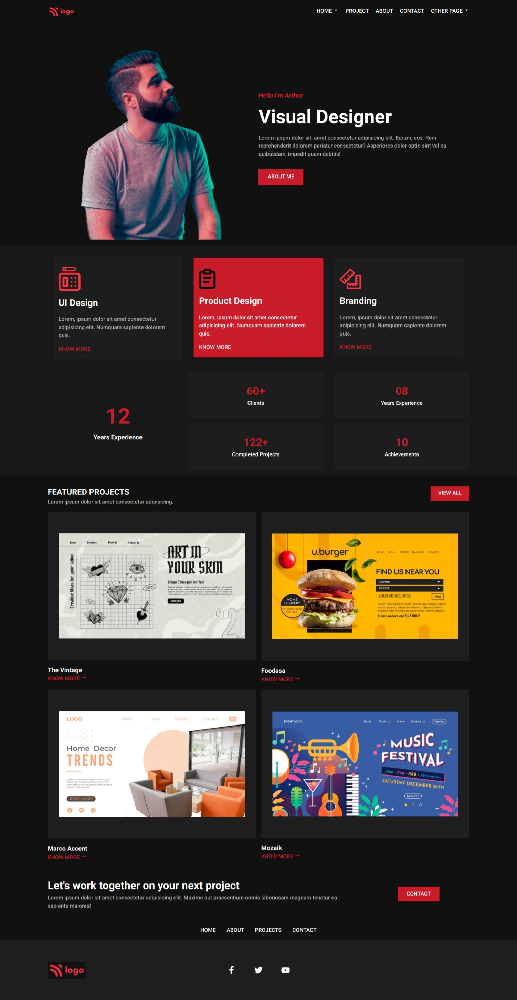

# Visual-Designer

# Visual Designer

> Project 15

<table>
<tr>
<td>
  A landing page designed using pure HTML & CSS.
</td>
</tr>
</table>

### Skills Gained from this

- Learned about CSS grid and how to change grid-template-columns based on different screen sized and also how to use flex and grid together to create powerful layouts

### Screenshot

## Device support

The site is compatible with mobile, desktop/laptop screens only.

## Author

